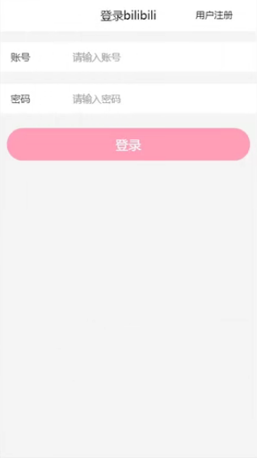
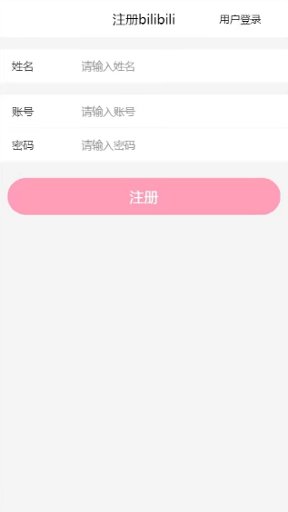
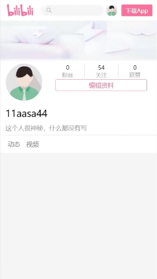
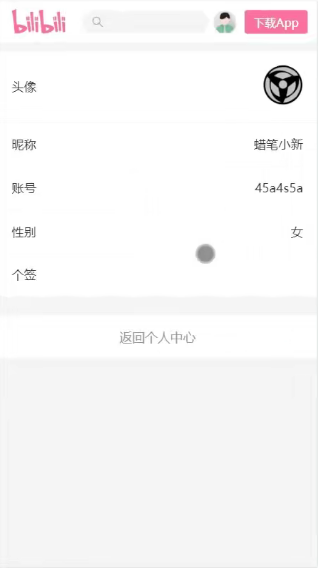
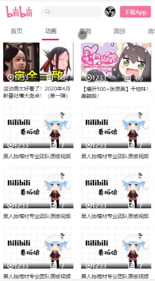
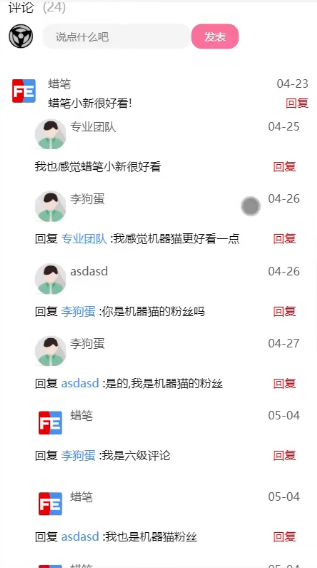

# 简介
### 一、项目介绍
**1.技术栈**

* vue2 + vue-router + ES6 + flex + vant + axios等

**2.实现功能**

* 登录功能、注册功能、权限验证、主页筛选功能、上传头像、编辑个人信息、下拉加载、视频播放、收藏文章、盖楼评论、发表评论

**3.数据接口**

> http://112.74.99.5:3000/web/api

### 二、项目运行截图

### 三、项目运行
* npm install
* npm run serve
